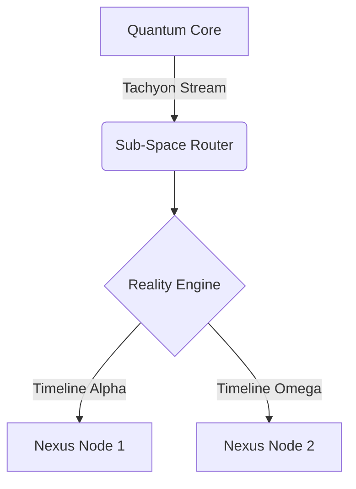

<div align="center">

# 🌌 PROJECT: NEXUS-9 // CHRONO-SPORK 🛸

<p align="center">
  
</p>

[]()
[]()
[]()

</div>

---

## 🛰️ // SYSTEM OVERVIEW

Welcome, Operative, to the central repository for **Project Nexus-9**. You have accessed a classified quantum-entangled codebase designed to interface with parallel timeline manifolds. Proceed with extreme caution; temporal anomalies have been reported in sectors 4 through 9.

```ascii
      ___
     /   \      [SYS_STATUS: ACTIVE]
    |     |     [COORDINATES: UNKNOWN]
    |===|       [REALITY: STABLE]
     \___/      
      | |       *WARNING: TEMPORAL DRIFT DETECTED*
```

---

## ⚙️ // MODULE ARCHITECTURE



---

## ⚡ // INITIALIZATION PROTOCOL

To instantiate this repository locally and link it to the central mainframe, execute the following directive sequence in your terminal terminal:

```bash
# Initialize the quantum core record
echo "# curly-octo-spork" >> README.md

# Boot up local git sequence
git init

# Stage the core manifest
git add README.md

# Commit initial reality anchor
git commit -m "first commit: initialize nexus-9 core"

# Set primary timeline branch to main
git branch -M main

# Link to the mainframe orbital relay
git remote add origin https://github.com/mcdmmc123-pixel/curly-octo-spork.git

# Transmit data streams to remote sector
git push -u origin main
```

---

## 📊 // TELEMETRY & DIAGNOSTICS

<div align="center">

| Subsystem | Status | Efficiency | Frequency |
| :--- | :---: | :---: | :---: |
| **Hyper-Drive** | 🟢 Optimal | $99.8\%$ | $4.2\text{ GHz}$ |
| **Shield Matrix** | 🟡 Fluctuating | $74.2\%$ | $1.1\text{ THz}$ |
| **AI Construct** | 🟢 Nominal | $100\%$ | $\infty$ |

</div>

---

## 🧬 // TECH STACK & FREQUENCIES

<div align="center">


</div>

---

## 🛡️ // SECURE TRANSMISSION LOG

> *"Any sufficiently advanced technology is indistinguishable from magic, but poor git commits are indistinguishable from chaos."* 
> — **Arch-Mage Ada Lovelace, Sector 7**

<br>

<div align="center">
  
  <p><i>[SEC_ID: 0x99A-PIXEL // END OF TRANSMISSION]</i></p>
</div>